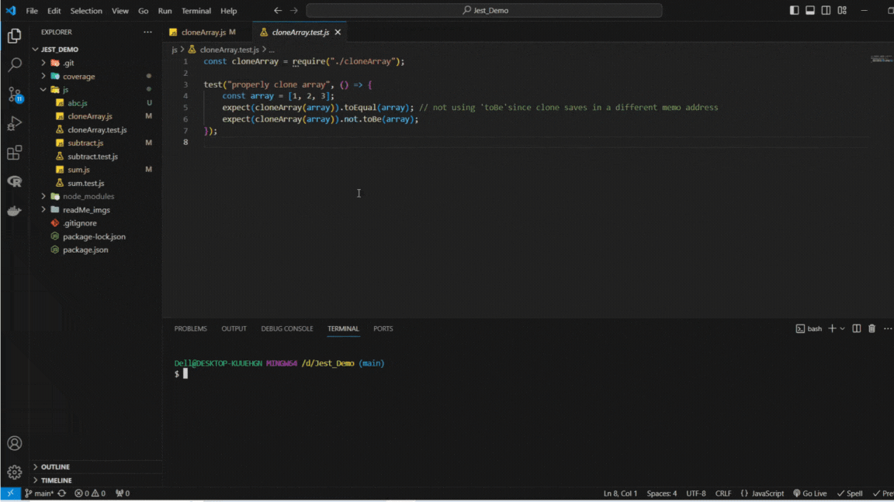

# Jest Quick Coverage

## Overview

The Jest Quick Coverage is a Visual Studio Code extension designed to streamline the process of generating and capturing test coverage for JavaScript related projects that use Jest as their testing framework. This extension allows developers to select specific test file/s and generate coverage reports, highlighting uncovered lines directly within the VS Code editor for convenient reference and modification.

_> Test coverage by selecting file_

_> Test coverage from code selection_

## Usage

1. In Extension settings setup the settings accordingly (check 'Extension Settings' section).
2. Select the desired **test file** in the Explorer sidebar.
    - Can select a **single** test file or **multiple** test files.
3. Right-click on the selection and select the "Get Coverage" option.
4. The extension will trigger Jest to generate the coverage report and mark uncovered lines within the editor or open coverage report based on your preference.

## Features

-   **Selective Coverage**: Easily generate test coverage reports for selected file or files using Jest.
-   **Visual Feedback**: Uncovered lines are marked within the VS Code editor for quick identification and remediation.
-   **Streamlined Workflow**: Simplifies the process of analyzing and improving test coverage within your project.

## Requirements

-   Visual Studio Code
-   Jest installed and configured in your project
-   GitBash terminal

## Extension Settings

-   Setup relative path of coverage-final.json.
-   Coverage view option, inline in vscode or in browser(recommended).
-   Git Bash path.
-   The test file format. Default is .spec.ts.

## Known Issues

There are no known issues with the current version of the extension. If you encounter any problems or have suggestions for improvement, please [submit an issue](https://github.com/RukshanDias/vscode-jest-coverage/issues) on GitHub.

## License

This extension is licensed under the [MIT License](LICENSE).

---

Thank you for using the Jest Quick Coverage extension! We hope it enhances your testing workflow and helps you achieve better coverage in your projects. If you find it helpful, consider leaving a review or star.
